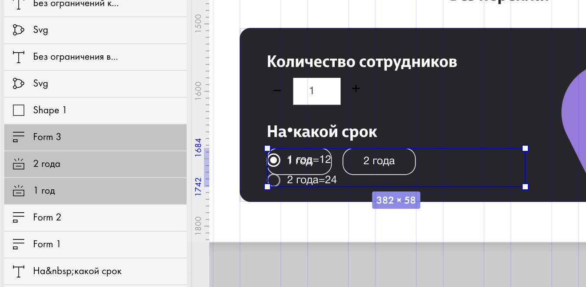
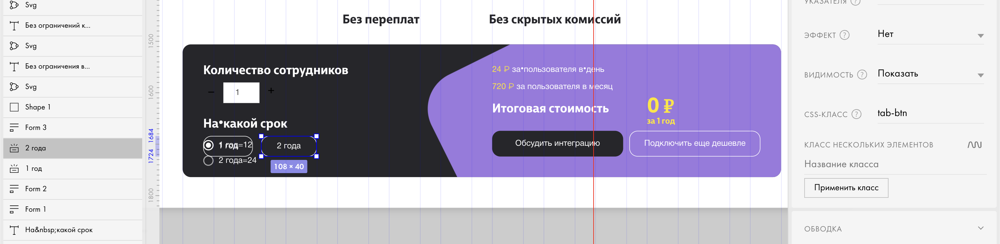
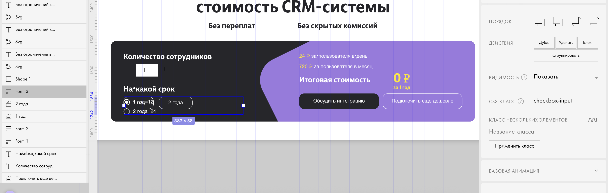

# Custom Calculator Module for a Website on Tilda

## Описание
Кастомный модуль калькулятора, созданный для сайта на платформе **Tilda**.  
Основан на модификации **Nolim**, но значительно переработан и дополнен собственным JavaScript-кодом с целью точного соответствия дизайнерскому прототипу и пользовательскому сценарию.

Модуль адаптирован под индивидуальные требования проекта и расширяет стандартные возможности калькуляторов в Tilda: динамические расчёты, визуальные эффекты, логика работы с выборками и вводом.

## Функционал
- Кастомная логика расчётов на основе пользовательского ввода и выбора
- Полная совместимость с Tilda (вставка кода через блоки)
- Модифицированная версия Nolim-калькулятора
- Дополнен собственным JS-кодом под задачу
- Расширенные стили: анимации, отображение итогов, подсветка элементов
- Поддержка адаптивного отображения на мобильных устройствах

## Технологии
- JavaScript (ES6+)
- CSS3
- Платформа Tilda
- Основной шаблон — модификация Nolim (с доработками)

## Пример использования

### В редакторе Tilda

1. Создайте форму или блок с элементами, соответствующими дизайну (выпадающие списки, переключатели, поля ввода), согласно модификации [Nolim](https://nolim.cc/calculator-tilda).
2. Загрузите иконки плюса и минуса в зеро блок и скройте их или загрузите в стандартный блок галлереи. Скопируйте ссылки на иконки и вставьте в код.
3. Для подсказки у цены добавьте текстовый элемент и задайте ему класс `forPrice`.
4. Для создания кастомных радиобаттонов создайте форму с радиобаттонами и задайте ей класс `checkbox-input`.
5. Под формой в слоях создайте две кнопки и задайте им класс `tab-btn`.
6. Загрузите код в блок t123, изменяя стили.

### Пример (визуальная схема)

*Добавление кнопок и формы с радиобаттонами.*

*Добавление классов кнопокам.*

*Добавление класса форме.*

